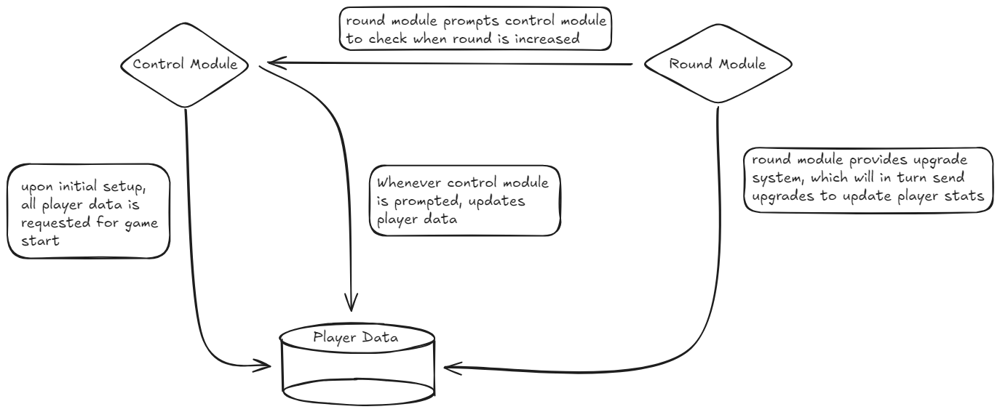

# CSCI 265 Design Document (Phase 3)

## Team name: We Haven’t Decided 

## Project/product name: Surrounded

## Contact person and email address

- Connor McDermid, mcdermidconnor@outlook.com

## Table of Contents
1. [Known Issues](#issues)
1. [Overview](#overview)
1. [Core Design Influences](#core)
1. [System Context](#syscon)
1. [Architectural Design](#arch)
	1. [Game Control Module](#archgcm)
		1. [Description](#archgcmdesc)
		1. [Initial Setup](#archgcminit)
		1. [Game Logic Processes](#archgcmproc)
		1. [The End Game Process](#archgcmend)
	1. [UIX Module](#uix)
		1. [The Input Process](#uixin)
		1. [The Output Process](#uixout)
		1. [Menu Navigation Map](#uixmenu)
	1. [Round Module](#roundmod)
		1. [Description](#roundesc)
		1. [Round Initialization Process](#roundinit)
		1. [Round Progression processes](#roundprog)
		1. [Boss Round Logic](#roundboss)
		1. [Round Transition Process](#roundtrans)
		1. [Game State and End Round Detection](#roundend)
		1. [Round Module Interaction Overview](#roundint)
	1. [Player Module](#play)
		1. [Responsibilities](#playmod)
		1. [Player Data Structure](#playdata)
		1. [Player Actions and Updates](#playact)
		1. [Player Interaction](#playint)
		1. [Player Initialization and Setup](#playset)
	1. [Enemy Module](#enemy)
		1. [Responsibilities](#enemyresp)
		1. [Enemy Data Structure](#enemydata)
		1. [Player Actions and Updates](#enemyact)
1. [Data Design](#data)
	1. [Player Data](#dataplay)
	1. [Enemy Data](#dataenemy)
	1. [Boss Data](#databoss)
	1. [Game Logic Data](#datalog)
		1. [Player Ship Data](#dataship)
		1. [Enemy Ship Data](#dataenship)
		1. [Item Upgrade Data](#dataup)
		1. [Round Data](#dataround)
		1. [Boss Ship Data](#databship)
		1. [Map Data](#datamap)
		1. [Display Data](#datadis)
	1. [Logical Entity Relation Diagram](#logerd)
1. [Game State and Flow](#gamstat)
1. [Transition to Physical Desin](#phys)
	1. [Implementation Decisions](#physim)
	1. [Object Model](#physobj)
1. [Appendix](#appendix)

## List of figures
Figure 1. [Context Diagram](#condiag)
Figure 2. [Game Control Module Diagram](#gcmdiag)
Figure 3. [UIX Module Diagram](#uixdiag)
Figure 4. [Menu Navigation Map](#menudiag)
Figure 5. [Player Module Diagram](#playdiag)
Figure 6. [Logical ERD](#erddiag)
Figure 7. [Appendix Diagram](#appdiag)

## 1. Known Issues/Omissions

In this section we list any currently-known errors, omissions, or other problems with the rest of this design document.

1. Collision detection with the games ships

2. Implementation of required interfaces not fleshed with enough detail

3. Confusion on how we should start approaching our code base

4. How we will know how certain aspects of Unity engine will function

5. Updating certain aspects of our requirements document

## 2. Product Overview

[Requirements Document](requirements.md) 
In this document, we discuss the design of our game Surrounded. Our Requirements document discusses these core features and our overall design perspective. These core features are essential to our game and its overall design. These will be elaborated further in our core design section of this document

The full vision for this game is essentially a single player experience, whereas it is launched and hosted by a singular player that interacts with AI opponents. The player is started in an open world filled with obstacles, where they are given basic movement abilities and a basic weapon to begin with. Here the player will engage in combat with the opposing enemies, who come in many different sizes and strengths and get increasingly more difficult as the game progresses. The design and function of the game is very simple: eliminate enemies, acquire upgrades and repeat.

There are several game features and mechanics whose design are essential and straight forward, our key points are:

* Detection of player actions (movement, combat)
* Handling of all menu systems, options and menu navigation (main menu, game over, main game hud, player stats, player upgrades)
* Collision detection (obstacles, enemy collision)
* Sound representation (on-map and enemy interaction)
* Controlling and updating enemy AI (their movement and combat)
* Handling of XP and level system
* Handling of Round System
* Handling of Enemy spawn system (credits system)
* Handling and storage of item and upgrade system
* Handling of random item generation system
* Handling of player statistics relative to upgrades (upgrades alter player)
* Detection/Handling of game-over situations (Game over menu presentation and ability to quit, restart)

## 3. Core Design Influences 

There are four core facets of the system we discuss here:

* An overall design methodology,
* The design implications of the round system and how it works,
* The general overview of the upgrade system,
* The design implications of the various objects and statistical design.

In terms of an overall design methodology, we wanted a 2D landscape with a restricted area with hordes of enemies. Generally for a majority of game designers this type of gameplay design is very common and for the most part easy to understand. We found that there were various game engines that could support implementation of the system (Godot, Unreal, for example), but we ended up choosing Unity because of their built in assets (such as built in colliders and 2D physics engine). Overall, the other options had their ups too.

Some of our biggest overall design problems we’ve faced so far in uncertainty of the extent of how to implement systems and ideas because of the lack of background with the engine, some of these uncertainties include:

- Unfamiliarity with C# as compared to C++
- Lack of foundation for implementing structures in game assets and features (such as enemy UI, floating objects in space, creating abilities, etc). As well as the general ability to navigate the Unity Engine fluently.

With respect to our first problem, we intend on using as many built in assets with the unity engine. This will be our main crux for the issue of us not being as efficient programmers with C#, as we don’t see it as a necessity to be completely fluent with C#. With this unfamiliarity affecting every member of the team. We all agreed to help each other with the programming aspect of the project if needed. This was due to us abandoning the team philosophy of having someone shadow the other. Rather, each and every member of the team has the ability to give input on design and programming choices.

For our methodology, it’s foreseeable that there might be some confusion on programming the back-end side of the project, as we are a school that focuses entirely to C++ using an engine that is built using C#. This does not mean however that we should abandon our current learnt design principles we’ve acquired from other classes so far here.

With respect to our second problem, after a bit of research on abstractable content and discussion of our GitHub branch system, the team has decided our main methodology was doing smaller implementations from whatever resources we could find (YouTube tutorials, other documentation for similar past projects, etc) and discussing what is likely best for our system and what isn't using our current background in programming. This discussion will occur via our discord and pull requests. We will also review each segment of code to assure proper conventions before adding each to main.

Due to this issue of a lack of background, for our project we plan on having a resource page built into our discord which we will use to gather as much knowledge from the landscape of game development using Unity. 

This fixes any sort of questions that might arise from working with our other teammates (eg. “What methodological procedure is best?” As well as “Where did you find this?”).

As mentioned above, one of our other challenges with the core design of the game will be our round system.

Our current philosophy of the round system is to have each round be 100 seconds, with the ending of each round destroying all current enemies which then features the prompt for the upgrade system (More details including the math and back-end philosophy are included in our requirements document).

To give a brief overview of the round system, it will feature a credit system whose function’s input is dictated by the round number. While we have yet to have any background with implementing such features, the philosophy of our game plan for implementation of this feature will be dictated using a mathematical function and an array containing an ID and run through a  while loop. All of this will not be visible to the player, but this sort of implementation will be present in each round. The credit rate will be increased by each round to dictate greater enemy spawns. We plan on tweaking this to account for balance changes and any potential misalignment with how our code runs.

To address the current upgrade system, we plan on having an entirely separate UI overlay which will appear over our current gameplay loop. Our methodology for this is to reference objects from prior classes which hold each upgrade and use a switch case to determine which upgrade to select that will be added to the player. The implementation of this overlay has yet to be fully fleshed out and is still in very early talks in terms of design philosophy. We will be using this switch-case like approach for the meantime as our current solution to how the back-end of the upgrade system could work as of right now. 

Finally, for our final facet implementation of our design of objects and statistical approaches we will be using a basic OOP class structure which will feature enemies, player’s ship, and upgraded ships as classes. All of the statistical elements such as enemy defense and player attacks will be already fleshed out in the class objects and will be updated based on upgrade. How each damage number is updated will be by conditions. An example of a condition could be if a ship's attack hits an enemy ship (collision) then subtract enemy health by the player attack function multiplied by an arbitrary number (however this is not finalized and is just a snippet of how functionality could theoretically work). As the game progresses, we expect the scope creep of enemy difficulty won't be dictated by enemy stats, but rather how many enemies spawn with each round to determine our games philosophy on the player's challenge.

A majority of these design choices are not final and subject to change however. This is all due to the uncertainty of how to fully grasp Unity and the vagueness of each challenge. With that said, we still remain confident in our project design and what any challenges could appear for us this term as game designers.

## 4. System Context

Based on a single player game and having round functionality, the diagram below will show how the game’s logical loop will function and how replayability will be handled.

Each interaction will feature a new UI for each decision made, and will follow boolean logic and other algorithms for progression of the system.

Figure 1. Context Diagram

## 5. Architectural Design

### 5.1: Game Control Module
The game control module works all from a local system, as everything is local and requires no network connection to work. The game control module is responsible for handling all in-play game logic. It is responsible for: 

* Responding to player input (mouse and keyboard input)
* Game status determination (Menu options, player death, application termination)
* Updating round data (communicates with round module) with due respect to game conditions (timer)
* Updating UI (communicates with UIX module) with due respect to game conditions (game pause, player death, round end)
* Updating player and enemy information based on player interaction (combat, collision), this communicates with the enemy module and player module
* Updating player data based on game conditions (Level up, upgrades), this communicates with out player module

The game control module is our central system module that communicates with other modules such as: 

* UIX Module: controller module tells UIX when to switch scenes, display menus and overlays, update UI elements (XP bar, health, score and stats/upgrades menu), requests the map design, and all necessary sound and music.
* Round Module: controller module communicates with the round data and credit system for enemies, when to portray boss rounds, and the in game round timer.
* Player Module: controller module communicates with the player module to acquire player data and statistics, upgrades system information, player score and players movement/attacks.
* The Enemy Module: controller module communicates with the enemy module to acquire enemy data and statistics, enemies movements and attacks system, boss data and statistics, as well as boss movement and attack systems

#### 5.1.1<a name="archgcmdesc">: Game Control Module Description

The game control module is responsible for the tracking of the current state of the player, the given input from the user, the control of enemies, all of objects and map information, round data, score, and all displayed UI and Menus, as well as the ability to detect game states such as boss rounds, game overs and pauses.

The core processes that are involved in the game module are:
1. Setup Process
2. Game Logic Process
3. End Game Process

The provided model below depicts the interactions of our game control module as it interacts with other modules and handles information given from user and other modules as the game progresses.

Figure 2. Game Control Module Diagram

#### 5.1.2: Initial Setup/Menu Process

The initial setup process begins upon execution of the game files, this where the title screen will be displayed and the player is given options to proceed before beginning with any gameplay. 

The anticipated sequence of events is:

1. User initializes game entering the setup process
2. Setup process display opening game menu
3. Player chooses to start a new game
4. Game Logic process is invoked

#### 5.1.3: Game Logic Processes

The game logic processes are responsible for moment to moment game control itself. All core gameplay actions and events are resolved here.

1. This is a rough outline of the expected sequence of events, these are explained further in their respective subsections:

2. User triggers start of gameplay from setup process, entering into the game logic process. All checks are repeated until End Game process is initiated.  

	1.  Start game boot-strap with 60 FPS lock  

	2. Contact UIX Module for display of initial game UI and continue to update accordingly

	3. Contact Player Module for player stat and control information
		* Determine if player actions occur and update accordingly

	4. Contact round module for round and enemy spawn information
		* Determine round module for any changes in rounds according to game clock

	5. Contact enemy module for enemy stat and control information
		* Determine if enemy actions occur and update accordingly

	6. Resolve all Player/Enemy/Round/UIX updates
		* Apply any updates sent by any of the modules and reiterate loop constantly

	7. Check for game-over (either go back through loop or proceed to step 3)

Invoke End game process

##### 5.1.3.1 Game Data Updates

In our game data updates we try to discuss all possible events/actions the game can recognize and respond to through user input. This information is as well shared with enemy AI which determines how they approach and interact with the player.

* Player Movement (WASD)
	* Omnidirectional movement through usage of WASD keys, player moves forward with W, backwards with S, and can turn left and right with respective A and D.
	* New location and direction is updated with camera as it is fixed on player

* Player Menu (ESC)
	* Opens player menu, allowing access to Resume Game, Upgrades List, Quit game

* Player projectile fire and aim (Mouse Movement and Left Click)
	* Player fires projectile with left click which is aimed at position of cursor
	* Projectile is created, and assigned stats according to player module 
	* Projectile information is stored until expiry (collision, expired distance)

* Collisions
	* Between Player/Enemy
	* Player and enemy both receive damage according to stats of each
	* Between Player/Wall
	* Player receives damage according static wall damage amount and is blocked from moving forward
	* Between Player/Projectile
	* Player receives damage according to projectile stat, projectile is then expired according to its stats and relative conditions

* Sound Generation
	* Sound is generated upon nearly any action created by player or enemy (Projectile fire, death, damage taken)
	* Sounds are generated upon menu interaction and game over presented

* Upgrade Decision
	* Player is presented with upgrade menu at beginning of new round, which is determined by round module
	* Player selects upgrade decision from randomly generated 3 items from items pool
	* Selected upgrade is then saved to player, adjusting stats accordingly and being stored for viewing in upgrades list menu, other options are deleted
	* Next round begins

* Player Death
	* Upon players health stat reaching 0 through means mentioned above, game will be sent into end of game process

* Round Update
	* Upon beginning of game, round count is set to 1, in which the round 1 data is called and requested from the round module
	* After 100 seconds, the round counter is increased by 1, the player is sent to the upgrade decision, and the next round is updated from the round module, increasing enemy credit count, and possible enemy spawns
	* After player finishes Upgrade Decision, next round begins

##### 5.1.3.2 Enemy Actions and Updates

In Surrounded, the space is filled with enemy ships, these enemy ships will be spawned by the round module and will attempt to get the player to the end of game process by eliminating all of the players health.

Each enemy's specific AI will be highlighted and further explained on their own in the enemy module, but simply, the enemy will approach the player x,y coordinate, and upon reaching a certain threshold distance, begin fire, attempting to damage, and further kill the user player.

##### 5.1.3.3 Game-Over Detection

There are two ways for the game to be sent into the end of game process
1. Players health stat = 0, causing the player death to occur
2. The player chooses the quit game option in the Pause Menu

Under any other circumstance, the game is not over.

#### 5.1.4 The End Game Process

This process is what proceeds the game logic process, as we have met the criteria to enter the end game process, meaning the player has either died, or has decided to quit the game. 
The steps to be taken are outlined here:

1. Determine if the player had died or quit game
2. If player has died, present game over screen, showing them their score, upgrades acquired and what round they achieved, as well as present them with the options on how to proceed next (Quit Game, return to main menu, restart game)
3. If player has instead chosen to quit, return them to the main menu, the setup process is then reengaged

### 5.2 UIX Module: 

The UIX module is to handle all of the local updates which happen to the player, all of the player inputs (such as camera movement, WASD, shooting, etc). All information containing player and enemy data will be processed on start up.

The control module will begin as soon as we run the game, containing the game logic and assets from the engine, this will pull UI elements with a display update, prompting the display data containing menus, and HUDs, and will be displayed based on the input.

The update to player display will directly be based on input as all files are local, we will discuss an input output process in 5.2.1 and 5.2.2.

Figure 3. UIX Module Diagram

####  5.2.1 The input process

The input process is for user commands such as keyboard, mouse, esc, etc. It will detect actions made by the user and then this data will be sent through the display data, which in turn creates the output on the screen (All local files, so no need for any delays in terms of input).

#### 5.2.2 The output process

The output process will be the main UI which feature main HUD elements and menus, different processes or actions for output in the local display include:

* Going from menu to menu (through main menu and pause menu).
* Adjustments to projectile upgrades UI on player and enemy ship displays.
* Adjustments to position of ship on the map.
* Adjustments to player health bar.
* Adjustments to boss health bar
* Adjustments to XP bar.

The type definition for all of this data will be discussed in section 6 of this document.

#### 5.2.3 Menu navigation map

The screens here are listed below, followed by a diagram showing each potential flow of menus

* Main Menu: start screen with options to start and quit the game
* Gameplay screen: general game overlay
* Game over screen: the UI overlay when players lose
* Pause Menu: for when players press esc
* Stats/Upgrade List UI: shows players stats and upgrades
* Upgrade selection screen: the player upgrade menu after round completion

Figure 4. Menu Navigation Map

### 5.3: Round Module
The Round Module manages all the data and mechanics related to game rounds, ensuring smooth progression throughout each stage. It is responsible for tracking the current round number, calculating available credits, managing enemy spawns, and updating enemy statistics to maintain gameplay balance and challenge.
Responsibilities of the Round Module:
* Round Tracking: Maintains the current round number and monitors round progression.
* Credit Calculation: Implements a scaling system for available credits, calculated using the formula: Credits=30×(1.1)(x−1) where x is the round number
* Boss Round Logic: Special logic for boss rounds triggers the spawning of unique enemies (e.g., W35-S315 and C0B-U5) at predetermined intervals (e.g., rounds 10 and 20).
* Round Timer: Controls the pacing of the game by regulating the duration of each round and the timing of enemy spawns.
* Enemy Spawning: Utilizes a dictionary mapping enemy types to their respective credit costs and IDs to facilitate efficient and balanced spawning logic.
* Dynamic Difficulty Adjustment: As rounds progress, the module dynamically updates enemy stats (damage, health, and speed) to increase the difficulty, keeping players challenged.
#### 5.3.1: Round Module Description
The round module operates as the central system for managing all aspects of gameplay related to rounds. It tracks player progress, manages enemy dynamics, and ensures that each round presents new challenges and rewards.
#### 5.3.2: Round Initialization Process
At the start of the game or after completing a round, the round module initializes the parameters for the upcoming round:
1. The game control module signals the round module to begin round initialization.
2. The round module sets the current round to 1 and calculates available credits based on the round number.
3. It populates the enemy spawn dictionary and prepares special boss logic for applicable rounds.
4. The module notifies the game control module that the round has begun.
#### 5.3.3: Round Progression Processes
During the round progression process, the module manages real-time gameplay, enemy spawning, and player interactions:
1. The round module is activated by the game control module.
2. Monitor the round timer, which determines the duration of the current round.
3. Spawn enemies based on the predefined credit costs and the dictionary mapping.
	* Enemy spawns are limited to 10% of the total available credits every 10 seconds, ensuring balanced encounters.
4. Notify the enemy module to manage enemy behaviors and interactions with the player.
5. Regularly check for player actions (combat, movement) and respond accordingly.
6. Adjust enemy stats dynamically based on the current round to increase challenge:
	* Update enemy damage, health, and speed based on scaling factors as rounds progress.
#### 5.3.4: Boss Round Logic
In rounds that qualify for boss encounters (e.g., rounds 10 and 20), the round module will trigger the following:
1. Notify the game control module to prepare for a boss encounter.
2. Spawn designated boss enemies (e.g., W35-S315, C0B-U5) at the start of the designated round.
3. Adjust the difficulty scaling for the round based on the presence of a boss, ensuring that the player is appropriately challenged.
#### 5.3.5: Round Transition Process
At the end of each round, the module manages transitions effectively:
1. Upon completion of the round, the round module communicates with the game control module to signal the end of the current round.
2. Present players with upgrade options based on credits earned in the completed round.
3. Update the round count and prepare for the next round's parameters.
4. Transition back to the round progression process for the next initialized round.
#### 5.3.6: Game State and End Round Detection
The round module checks for the completion of rounds based on two conditions:
* All enemies in the current round have been defeated, resulting in successful round completion.
* The round timer has reached zero, which also triggers a transition to the next round.
#### 5.3.7: Round Module Interaction Overview
The interaction model outlines how the round module communicates with the game control, player, and enemy modules throughout the game, ensuring a seamless and engaging gameplay experience.
### 5.4: Player Module
The Player Module is designed to manage all aspects of player data within the game, ensuring a seamless experience as the player progresses through various rounds. This module interfaces closely with the Game Control Module and the Round Module to ensure correct data is given to control module for gameplay
#### <a name="playmod">5.4.1: Player Module Responsibilities
The Player Module is responsible for:
* Tracking Player Statistics: Keeping a detailed record of player health, experience points (XP), levels, and acquired upgrades.
* Facilitating Player Input: Interpreting user commands for movement, combat, and menu navigation to ensure responsive gameplay.
* Updating Player Status: Modifying player attributes based on in-game events, such as damage taken or upgrades acquired.
* Communicating with Other Modules: Collaborating with the Game Control Module for game events and the Round Module for tracking current round conditions and enemy interactions.
This is how the player module interacts with other modules, and why they are interacting:

Figure 5. Player Module Diagram

#### 5.4.2: Player Data Structure
The Player Module maintains the following key data elements:
* Health: Current health points, decreasing as damage is sustained from enemy attacks or environmental hazards.
* Experience Points (XP): Accumulated points gained through gameplay, contributing to leveling up and unlocking upgrades.
* Level: Represents the player's current level, which affects overall stats and available upgrades.
* Upgrades: A list of enhancements selected by the player that improve abilities or stats, stored for reference during gameplay.
* Movement State: The player’s current position and orientation within the game environment, updated in real-time based on user input.
#### 5.4.3: Player Actions and Updates
The Player Module gets data from the Control Module which manages various actions and updates as follows:
1. Movement Control:
	* Players navigate using the WASD keys for omnidirectional movement.
	* The module continuously updates the player's location and facing direction, maintaining camera focus on the player.

2. Combat Mechanics:
	* Players utilize mouse movement and left-click to aim and fire projectiles.
	* Each projectile is generated with specific stats (e.g., damage, speed) and tracked until it either collides with a target or expires.

3. Upgrade Mechanism:
	* At the beginning of each new round, players are presented with an upgrade menu displaying randomly selected options.
	* The chosen upgrade is sent from Round Module and enhances the player's stats and is stored for future use

4. Player Death:
* If the player’s health reaches zero, the module triggers a game-over sequence, coordinating with the Game Control Module to initiate the end game process.

5. Dynamic Stat Updates:
* As rounds progress, the Player Module dynamically adjusts to the data sent from Round Module based on difficulty scaling, ensuring that encounters remain challenging. This includes adapting health and damage values in response to the game's round mechanics.
#### 5.4.4: Player Interaction with Other Modules
The Player Module communicates effectively with various other modules:
* Game Control Module:
	* Provides real-time updates on player stats (e.g., health, level) and reacts to gameplay events initiated by user actions.

* Round Module:
	* Interacts closely to track the current round number, which in turn is related to upgrade system, the round module gives upgrades which in turn need to be applied to player stats and module

* UIX Module:
	* Updates the user interface to reflect player stats, such as health and XP, enhancing the player’s understanding of their current status.
#### 5.4.5: Player Initialization and Setup
Upon the initiation of a new game or round, the Player Module executes the following steps:
1. Setup Player Stats:
	* Initialize player attributes, including health, XP, level, and available upgrades, according to game parameters and outcomes from previous rounds.

2. Display Player UI:
	* Collaborate with the UIX Module to render the player’s HUD, ensuring that real-time feedback on health, upgrades, and scores is readily available.

3. Prepare for Input:
	* Establish input listeners for keyboard and mouse actions, allowing for immediate response to player commands for movement and combat.

4. Reset Positioning:
	* Position the player at a defined starting point in the game world, ensuring proper camera alignment and interaction with the environment.
The Player Module is integral to the gaming experience, managing player interactions and evolving capabilities in conjunction with the game’s round dynamics. By maintaining a responsive and adaptable framework, the module enhances player engagement and ensures a consistent challenge throughout the game.
#### 5.5 Enemy Module
The enemy module, similar to the player module, holds data and information for the game control module and UIX module to use. The enemy module also contains the information for their AI and as well as the bosses AI and data.
#### 5.5.1: Enemy Module Responsibilities
The Enemy Module is responsible for:
* Tracking Enemy Statistics: Keeping a detailed record of enemy health and experience points (XP) that will be given to players upon defeat.	
* AI: Updated movement of enemies, enemy decision making, how enemies collide with objects.
* Communicating with Other Modules: Collaborating with the Game Control Module for game events and the Round Module for spawn rates current and enemy types.
#### 5.5.2: Enemy Data Structure
The Enemy Module maintains the following key data elements:
* Health: Current health points, decreasing as damage is dealt by attacks from the player.
* Abilities: Current enemy types abilities and stats which are made in the classes booted by the game control module.
* Movement State: The enemy’s current position and orientation within the game environment, updated in real-time based on collision detection.
#### 5.4.3: Player Actions and Updates
The Enemy Module gets data from the Control Module which manages various actions and updates as follows:
* Movement Control:
	* The module continuously updates the enemy's location and facing direction, spawning outside players POV.
* Combat Mechanics:
	* Enemies aim and fire projectiles.
	* Each projectile is generated with specific stats (e.g., damage, speed) and tracked until it either collides with a target or expires.
* Enemy Death:
	* If the enemy health reaches zero, the UI will display animation and XP will be given to the player on completion of kill

## 6. Data Design
In this section we describe how the information elements are manipulated by the game system.
Currently we have information divided into these broad categories:
* Player data (information about the players stats and attributes paired with the overlay)
* Enemy data (enemy stats and how enemies attributes are updated)
* Boss data (How boss functionality works and how it pairs with round system)
* In-game data
The four information groups will be covered respectively 6.1 - 6.4 respectively, and the information’s entirety will be represented by a diagram in 6.5.

### 6.1 Player data:
Players data refers to information which concerns how gameplay data will function outside the game loop which means:
* The player will spawn with the base ship (base case will be introduced as a class)
* The players data and statistics will be stored in a class containing in game data (see 6.4.1)
This player data will stay static through the boot up process, with the ship's features being updated with the in-game upgrade system and will update UI during the game loop.
The player data will update along with each upgrade as well. The upgrade system will use pre-built classes containing upgrades as objects. Each object will be added to our current base stats and character functions. 

### 6.2 Enemy data:
Enemy data will refer to how the actual gameplay data of enemy IDs will flow. This concerns the likes of enemy spawns and enemy types. Examples of enemy data which will be updated outside of the gameplay loop include:
* The enemy spawns which will be determined by each round (base case of enemies dictated by credit and thrown into our function referred to in our round module).
* Enemy types will feature different UI (Each enemy object uses a sprite).
* Enemy types will also be contained in a class and will be spawned using a function.
All of these spawns and types will be updated as each round increases, most likely syncing to when each round starts after our item-upgrade menu is completed. 
### 6.3 Boss data:

Boss data will refer to how the actual gameplay data of boss IDs will appear in game. This concerns the likes of UI overlay with bosses and how each boss class will look. Examples of boss data which will be updated outside of the gameplay loop include:
* UI updates with a Boss health bar over the game loop UI
* Boss attack algorithm, (will be included in a class which has each unique move, will have a telegraphed attack pattern).
* Round system acknowledging its a boss round (Will look at round count to start boss round).

All of these boss data types will be updated at round 10 to round 20, with assets of bosses most likely being reused at rounds higher than 20. The round system will check for round 10 or 20 respectively (most likely will use an if condition).

### 6.4 Game logic data:

The game logic data needs to represent all the information about every player ship variant, enemy variant, boss data, and item upgrade, and any map related data which will appear in the current game state. This will be the biggest section to organize but this collection of data will be generalized for the sake of ease of understanding. 

Our data will be dissected into these categories:

* Player ship data
* Enemy ship data
* Item Upgrade data
* Round data
* Boss data
* Map data
* Display data

We will go into more depth of each category individually (in sections 6.3.1 to 6.3.8 below), then modeled as an entity-relationship diagram (section 6.5).

#### 6.4.1 Player ship data:

The information to be maintained for each player ship is as follows:

* Unique Class ID
* Sprite, Colour.
* Health stat
* Attack stat
* Defense stat
* Speed stat
* Current x,y coordinates and map zone
* Current direction facing
* Current upgrade
* Level and XP total

#### 6.4.2 Enemy ship data:

The information to be maintained for each enemy data is very similar to player data, it appears as follows:

* Unique Class ID
* Sprite, Colour.
* Health stat
* Attack stat
* Defense stat
* Speed stat
* Current x,y coordinates and map zone
* Current direction facing
* Current ship total
* Current credit cost of each enemy

We need to add some more specifics to enemy AI movement however, these include:

* Their working WASD with telegraphed movement patterns
* Constant player movement and collision detection
* Sound and Indicators

#### 6.4.3 Item Upgrade ship data: 

The information needed for items will include these following:

* Unique ID
* Display over sprite (New UI update per each upgrade)
* Current x,y of items bullet trajectory and map zone coverage
* Current stat changes (will also change with XP system)
* Current upgrade system adding count for each upgrade

#### 6.4.4 Round data:

The current round system involves inputting round count into a function as the game logic process begins.

The current round system will have these properties updated:

* Enemy spawn rate (based on function)
* Credit count
* Round count
* Credits spent
* Enemy IDs (using while loop)
* In game timer
* Player health (At end of each round, player will have health restored)

#### 6.4.5 Boss Ship Data:

The boss data will be dictated by specific round count, the current boss properties which need to be identified include:

* Unique ID
* Current x,y location and area on map
* Current Boss health 
* Health UI for boss
* Display and animations of hit registration
* Current ability usage
* Current attack stats
* Current defense stats
* Current speed stats

#### 6.4.6 Map data:

The design of the map data is most likely going to feature a simple restricted area with an out of bounds prompt for each time players ship access a restricted x,y.
These zones will damage the player as well, and will have a UI display.
For the majority of the terrain, it will have an overlay in the background indicating where on the map you are located based on specific zones which are static in the background. The images of these will be loaded as soon as the game loop starts.

#### 6.4.7 Display data:
The display data covers which portion of the map the current player's gameplay will view. It will be in a locked camera which will show a portion of the map.
The specific properties that will be stored are:
* Current width and height of the display (on a locked screen)
* Current x,y coordinates updated in our system

### 6.5 Logical ERD
In this section we relate the data components (class objects) used for the game, as well as attributes such as stats related to each object.
The entities we will reference in this diagram will be all of the ones referenced prior in 6.4’s list.
We will use a chart to determine the logical components of each attribute to reduce complexity:

Figure 6. Logical Entity-Relationship Diagram 

## 7 Game state and flow of play
In our current iteration of the game we are restricted to one map with a set boundary that will spawn enemies outside of the camera radius, this process is relatively structured with our game logic and has an intuitive sequence of actions with spawns occurring based on a credit count. Ideally we could maybe refine our algorithm to be less exponential overtime for the sake of ease as having a base 30 multiplier at times can be hard to track in terms of enemy spawns. 
Generally our game flow will follow a series of events listed below, however the bulk of our steps are mostly covered in the system context design diagram listed in 4. The game will be primarily based around menu prompts, round conditions, and the game over condition, all simultaneously updating each sequence of the UI.
This list will be a very bare bones summary of the system context but in a rather user faced perspective to give a general idea of what the user might encounter on first start.
The sequence follows:
1. In Main Menu
	* Select Start Game or Quit
2. In the Game Loop
	* Begin piloting ship and encountering enemies
	* XP increases per enemy ship destroyed
	* Enemies begin to spawn based on round number
3. Round Ends:
	* Upgrade prompt appears and the user selects an upgrade
4. New Round Begins
	* Player health returns to 100, upgrades gets applied
5. Boss Round:
	* Prompt appears indicating a boss round
	* Distinct moves selected from boss’s tool kit
6. Game Over prompt
	* Player has reached 0 health
	* Game over UI is prompted

At the game over prompt the user will be able to decide whether they want to play again or quit.

The game could go on for many rounds, with much of the gorey details of higher round counts and discussion of scope creep still on the table for discussion.

The enemies will all spawn outside of the player camera, and will positionally shoot based on radius of enemy and radius of player. The game logic will mostly deal with enemy spawn rates and updated credits to dictate spawns. The enemies will spawn infinitely and the credit count will determine which enemies spawn. This goes on infinitely until the round timer is done.

## 8 Transition to physical design

In this section we will give a layout of transitioning from logical design to a physical design suitable for our game. As of the present moment, we have only just started the actual physical design process and are not very deep into fleshing out version 1 of our game. We have chosen C# and the Unity engine has discussed as a team types of pseudo code from prior meetings to make implementations. However we have not modeled all of the pseudo code.

In the current iterations we have made in our github testing branch we already have some actions such as WASD and projectile design in its alpha state. With some sprites and objects starting to see light of implementation but in a very early state. Examples of these include collision detention of our enemy sprites and projectile registration on hit.

### 8.1 Implementation decisions

The question we asked ourselves in the beginning was which game engine we would like to work with. Our options at the time were Godot, Unreal, and Unity. The decision was unity, however there was some speculation early on to have Godot be our engine as it featured c++.

Because we wanted to use Unity as our engine, the mandatory step was to use C# as our main language of choice, and use any pre-built assets given to us by unity to create physics, sprites, and projectiles without the necessity of having to form many class/object designs from scratch.

### 8.2 Object model

As of what was discussed prior in section 6, we did have many of our various pieces of data we wanted for each class object already decided. However as of now we have yet to start implementing these objects, and have not discussed a fleshed out approach to implementing the system. The hope is that as we begin to approach phase 4 this decision process will be mostly decided as a team.

## 9 Appendix: the total design

This diagram captures all of the module diagrams together into a “total” design, capturing all of the interactions between key elements of the modules. It is intended to be used to cross reference various module diagrams. Module information is discussed prior in section 6.

Figure 7. Appendix Diagram

