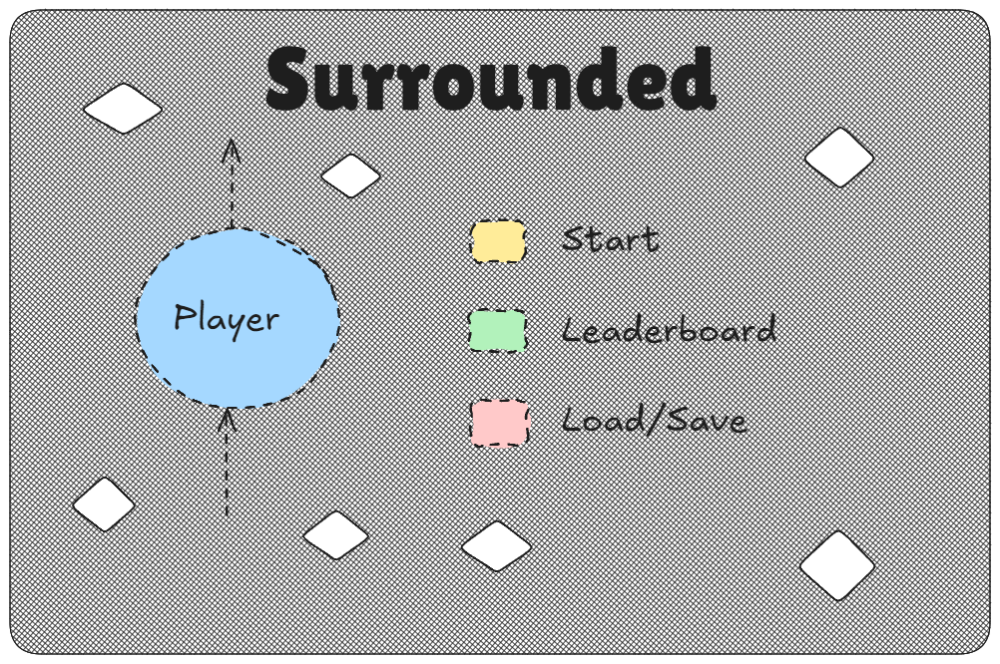
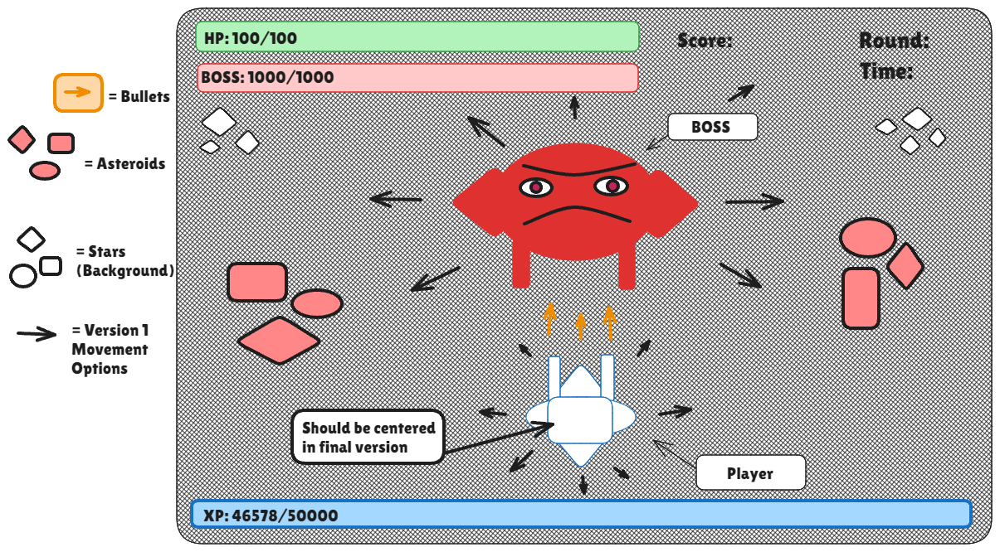
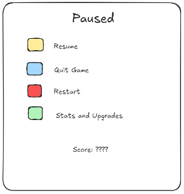
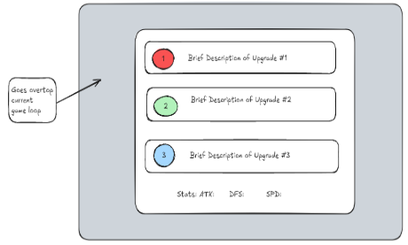
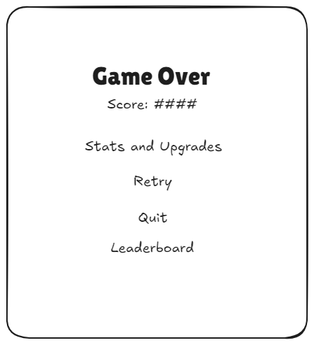
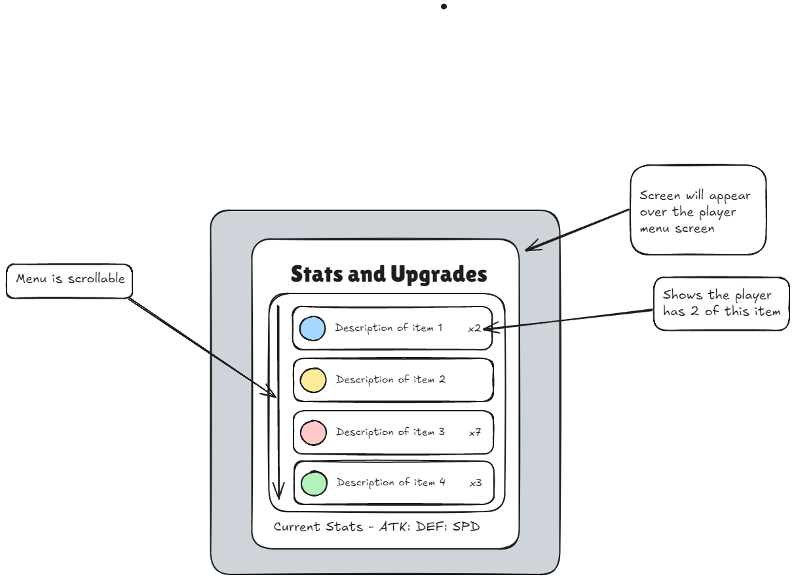
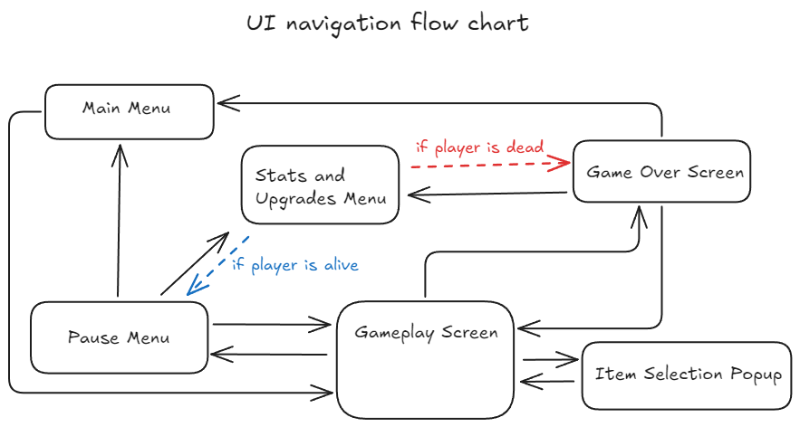

# CSCI 265 Requirements and specifications (Phase 2)

## Team name: We Haven’t Decided

## Project/product name: Surrounded

## Contact person and email

The following person has been designated the main contact person for questions from the reader:

 - Connor McDermid, mcdermidc@stumail.viu.ca

## Table of Contents

1. [Problems that are known](#problems) 

1. [Game overview](#overview) 

1. [Target audience and motivation](#target)

1. [Game flow, objectives, and plot-line](#gameflow)

1. [Key features and behaviour](#keyfeat)

	5.1. [Player, Controls, and Combat](#player)

	5.2. [Map and Terrain](#map)

	5.3. [XP and Levelling System](#xp)

	5.4. [Round System](#round)

	5.5. [Enemy Design](#enemy)

	5.6. [Bosses](#boss)

	5.7. [Upgrade Items and System](#items)

	5.8. [Sounds and Music](#sounds)

1. [User interface and navigation](#ui)
 
1. [Use cases/scenarios](#uses)

1. [Non-functional requirements](#nonfunc)

1. [Feature prioritization](#featprio)

1. [Glossary](#glossary)

## List of figures

[Figure 1. Main Menu](#mainmenu)

[Figure 2. Gameplay Screen](#gameplayscreen)

[Figure 3. Pause Menu](#pausemenu)

[Figure 4. Item Selection Pop-up](#itemselection)

[Figure 5. Game Over](#gameover)

[Figure 6. Stats and Upgrades Menu](statsandupgrades)

[Figure 7. UI Flow Chart](#uiflowchart)

## 1. Problems that are known 

The document mentions cryptic messages in between rounds revealing the story to the player. We don’t have any specific messages made yet and we didn’t include where it would appear on the screen in between rounds. 

As the game needs to be playtested to know if it is balanced and if values are appropriate, a lot of the values and scaling is subject to change. This is stated in a disclaimer at the top of the [Key features and behaviour](#keyfeat) section.

The same goes with the UI likely not being in its final form and layout, as playtesting may lead to finding issues with the user experience. A disclaimer has been put in the [User interface and navigation](#ui) section.

## 2. Game overview 

Surrounded is a single player, 60 FPS, top-down shooter where enemies gain strength over time through an in-game upgrade system that is used to progress. The player operates a ship and fights on a top-down 2D plane. The game will be point based and will also have an XP levelling system. The game is best suited for solo gamers who are interested in playing a bullet-mayhem style that is an endless roguelike.

The player will battle with enemy ships. The goal is to survive as long as possible by eliminating enemy ships before they eliminate you. Eliminating enemy ships yields XP that will increase base stats upon level up. Additionally, the ship can be hit by asteroids and blocked by other terrain, so you must not tunnel vision on your opponents! Upon completion of a round, the player will be prompted with 3 random ship upgrades or items that boost the player. The player must choose one of the three items to progress, and the next round will begin. Additional details about enemies, levelling, terrain, and upgrades can be found in the key features section.

The enemies of the game will increase in difficulty based on the round and will gradually get more difficult and have different variants. We plan to use a credit system to spawn enemies, similar to the enemy spawning system in the game Risk of Rain, where enemies cost a certain amount of points to spawn and points go up as the time and level goes up. Additional details about enemy scaling and the credit system will be in the game flow and round-based profession system sections.

The objective of the game is to keep playing for as long as possible to get the highest score, gaining as much XP and upgrades to see how long you (the player) will last. There is no limit to how long a run can be, but the option to save the game is a stretch goal, meaning the player must do their run without closing the game (there will be a way to pause the game by opening the menu).

## 3. Target audience and motivation

This game will appeal to action loving single-player top-down shooter enjoyers who like to operate multi-directional, ‘bullet hell’ style combat against hordes of enemies. 

The gameplay style is between the bullet hell and rogue-like genres of games. The game is intended to start slow and progressively get more chaotic and overwhelming as the rounds progress. As the game is inspired by Asteroids, it’s intended for users who enjoy arcade type games, with the addition of crazy fun power ups akin to those that you see in other traditional rogue-likes.

Everyone in the Discord has some form of background playing video games, with each of us giving inputs based on games we have played ourselves. This will be our first time creating games together. However, we are very eager to combine our background in games and background in programming, as all of us are very interested in the creation process of our beloved games.

The game’s controls are currently with keyboard and mouse, with no plans to add controller, or touch-screen control support at the moment, meaning this game is meant for PC users only.

## 4. Game flow, objectives, and plot-line 

### 4.1: Objective

The goal of Surrounded is to survive the onslaught of enemy alien ships for as long as possible. There is no way to “win” and instead success is measured by a score that is presented in the top right of the screen. Score is a running tally of the total amount of XP gained over the course of a run, plus the number of rounds survived (100 for normal round, 500 for boss round).
* Calculation is Total XP + (round number * 100) + ((round number / 10) * 500)

The player begins as a ship with the ability to move in 8 directions using the WASD keys. The ship initially has a single-bullet attack that shoots towards your mouse cursor and requires left click to fire (left click can be held down).

### 4.2: Gameplay loop

Our gameplay loop is a round-based system. Each round, the game has a finite amount of credits it can use to spawn in enemies:
* Each enemy requires a certain amount of credits to spawn, the harder the enemy, the more credits it costs to spawn. 
	* This creates variation in each run, as round 3 may spawn a different assortment of enemies in two different runs.
* Each round will have 5 seconds of grace time at the start to let the player get ready.
* The game can only spend 10% of its total credits for that round every 5 seconds. This means each round lasts exactly 55 seconds.
	* Having it be 10% of the total amount blocks off harder enemies from being able to be spawned until later rounds.
* The way the credits are spent is completely random, this process is described in the Round System section.
* The enemies will spawn just off-screen of the player and will chase and shoot at the player.
* The more enemies and bosses you kill, the more XP points you get. The more XP you get, the more times you level up. Each level increases your base stats by a flat amount (see the XP and Levelling System section for amounts).
	* Killing harder enemies yields more XP, bosses grant a large amount of XP (see Enemy Design section for amounts).
* At the end of each round, all enemies are wiped from the screen and the player gets prompted with 3 random items. The player must choose 1 item to boost their ship, these items will be described in key features. 
	* As a secondary feature, we will introduce item rarities. Better items will be more rare, and the higher the round, the higher the chance for rare items is.
* At the start of each round, the game’s credit amount will be reset to the previous round’s credit amount and increased by 10%.
	* This is so scaling is slow and manageable to start but becomes exponentially more chaotic as rounds pass.

### 4.3: Additional information

The playing field will be several screens long in both the horizontal and vertical planes. The camera will keep the player in the centre of the screen, even when the player is near a world boundary. As a stretch goal, we plan to expand the playing field to be infinitely big.

There will be asteroids floating in space which the player can use as a shield or as a way to juke the enemies. Make sure not to get hit by moving asteroids though as they will deal damage to the player!

More details about the map size, camera, and asteroids can be found in the Map and Terrain section of key features.

### 4.4: Story

The story is based around a lone survivor traversing an unknown space field referred to as V1U. As the last of their kind from Earth, the player will traverse the V1U field out in the cosmos in hopes to find life. However, the player will only encounter rogue, AI-controlled ships which will try to eliminate the player. Slowly, through in-game text displayed at the end of rounds, they will discover that there is a mastermind unit controlling these AI ships, named W35-S315. Once defeating the W35-S315, the player will discover that W35-S315 was just like the other ships and didn’t have a mind of its own. Instead, it is revealed that W35-S315 is a servant of the great overlord C0B-U5. Overtime, more of the story of the V1U space field will be revealed to the user through completing rounds.

*The cryptic text:* The text will reveal the story to the player through vague statements. It is intended to not be very direct and is something that the user will have to pay attention to and piece together to understand. At the end of each round, the player will disappear and about 1-2 lines of text displaying the cryptic text will appear for about 5 seconds before it disappears and the player is prompted with the [item selection pop-up](#itemselection).

## 5. Key features and behaviour

The game will consist of moving through 2D space and piloting a base ship through a map, fighting hoards of space enemies in waves. With this, some of the key features/aspects of the game are broken down with these key topics:

*Disclaimer: All chosen values are preliminary and are likely to be changed after playtesting to ensure the game is fun and balanced during all stages.*

### 5.1: Player, Controls, and Combat
* The Player's main control system will be using WASD to move, using the mouse cursor to aim, and left click to shoot (left click can be held).
* The player model will always be facing the player’s cursor relative to its central position, with the turrets being attached to the front.
* The player is restricted to 8-directional omni movement with WASD, but can look and shoot in any direction (360 degrees). 
* Each time an enemy is shot, the enemy will flash red for 0.2 seconds to give the player visual feedback that they successfully hit the enemy.
* Ammunition for firing will be infinite with no need for reloading. 
* Upon being hit, the player’s health bar will be updated by this formula:
	* New health = (health) - (damage taken - defence)
	* If (damage - defence) <= 1, (damage - defence) = 1
* The player will be granted 20 invincibility frames upon hit, so they don’t seemingly die in an instant. As the game is intended to run on 60 fps, the player will have 0.33 seconds to recover after being hit.
	* The player will blink when they are currently invincible.
* When the player’s health hits 0 from being hit too much, the player has lost and the game over UI will lay over the screen (see UI and Navigation section for details).
* The player’s health will not regenerate throughout a round. Their health will be replenished to full at the start of each new round.
* Each time an enemy dies (their health hits 0), there will be a short exploding animation to communicate their death to the player. The explosion will not linger to reduce screen clutter.
* Combat will include collisions meaning the player or enemy ships can crash into each other or asteroids.
	* A player crashing into an enemy deals the enemy's current health as damage to both the enemy and the player.
		* Note: This is to make crashing into enemies equally punishing throughout the game and not punishing only early on.
	* Two enemies crashing into each other deals 100 damage to both enemies.
	* A player or an enemy crashing into an asteroid will deal 50 damage to both the player/enemy and the asteroid (asteroids will have health as described in the next subsection).
* Players will start with base stats of: 5 attack, 3 defence, 10 speed, and 50 health.
	* The player's speed will be capped at 30 with no other benefits for going above it (as of now).
* Each enemy will have their own base stats and health defined in the Enemy Design section.
* Player and enemy stats will increase by a flat amount throughout the game, details on this are in the XP and Levelling System and Enemy Design sections.

### 5.2: Map and Terrain

#### 5.2.1 World Boundary:
* The map will be finite and not randomly generated, having floating asteroids that spawn in with the ships as the player is fighting for their life.
* The map will be 8 times the screen width and 8 times the screen height (assuming the user is using a 1920x1080 resolution).
* If a player leaves this 8x8 screen length map, they have exited the world boundary.
* Upon exiting the world boundary, the player will be presented with giant red text in the middle of the screen stating "WARNING: Out of Bounds. 5 seconds until comet deployment". And a 5 second timer will begin to countdown to 0.
* When the timer reaches 0, a heatseeking comet object will be instantiated that will chase the player, eliminating them in one devastating blow. The comet moves slightly faster than the player's current speed (1.1 * player speed), meaning the player cannot outrun the comet once it spawns.

#### 5.2.2 Asteroids:
* There will be floating asteroids throughout the map, typically in clusters of 3-5.
	* There will be a maximum of 16 clusters of asteroids on the map at once. Every time enemies spawn (every 10 seconds), asteroids will spawn randomly throughout the map until there are 16 clusters.
	* The asteroids will move at a slow rate, probably at half of the player’s base speed at level 1 (speed is 5).
	* The asteroids will move in a predetermined, straight direction until they leave the screen, in which they will despawn when off screen.
	* The asteroids will have collision boxes meaning the player, enemies, and projectiles cannot pass through them.
	* Running into them will harm the player and enemies, damaging them for 50 health. Be careful!
	* If something collides with an asteroid, the individual asteroid will be destroyed. 
	* Asteroids will always take 3 hits for the player to destroy as their health will be 3 * (player damage).
		* This is so they aren't too easy to destroy whilst in combat, allowing them to pose a threat.

#### 5.2.3 Other Information
* The background of the map has an assortment of stars and a nebulous mist is layered above it. The nebula will change colours each round (with a few preset options) to give the player a more interesting visual experience.
* The camera that is following the player will be about 1/64 of the size of the entire map, this camera will be centred onto the player at all times (except boss rounds).
* The players will be able to traverse all the map freely, as long as they don’t run into any obstacles, with enemies spawning just outside of the player camera randomly.

### 5.3: XP and Levelling System
* The XP and levelling system is meant to reward the player for killing the enemies instead of just running from them and waiting out the timer.
* The player will gain XP by killing enemies (and bosses in boss rounds), the XP amount that killing an enemy grants the player will be based on type and will be specified in the Enemy Design section.
	* For now, just know that killing harder enemies yields more XP and bosses grant a large amount of XP
* The more enemies and bosses you kill, the more XP points you get. The more XP you get, the more times you level up. Each level increases your base stats by a flat amount.
	* Each level, your health will increase by 10, and your defence, attack, and speed will all increase by 3.
* The XP required to level up will be the following formula:
	* 30 * (1.1)^(y-1) where y is the current level number.

### 5.4: Round System
* Each round lasts exactly 55 seconds.
* Each round will have 5 seconds of grace time at the start to let the player get ready (part of the 55 seconds).
* Each round, the game will be given an amount of total credits for that round.
* The round’s total credit amount will start at 30 and be increased by 10% from the past round. The round credit amount formula will be 30 * (1.1)^(x-1) where x is the current round number.
* Every 5 seconds (starting at 50 seconds), the game will get 10% of that round’s total credits to spawn enemies.
	* The reason for this is to not let higher level enemies spawn in lower rounds.
	* At the same time, the game will spawn asteroid clusters until there are 16 of them on the map
		* If there are already 16, will not spawn any.
* Each enemy requires a certain amount of credits to spawn, the harder the enemy, the more credits it costs to spawn. The credit amounts are found in the Enemy Design section.
* The way the credits are spent is random, meaning the assortment of enemies is random. We will have a function to select the enemy type based on round and available credits:
	* Every 5 seconds the function will be given 10% of the round’s total credits to spend.
	* We can use a dictionary (probably implemented with an array) to hold an enemy ID and credit cost pair for each enemy.
	* Then, a while loop spawns enemies until the remaining credits left to spend is 0.
	* The while loop will generate a random enemy ID, and try to spawn that enemy. 
		* If it has enough credits to spawn that enemy, it will spawn it and subtract the credit amount from the credits in the function.  
		* If it doesn’t have enough credits to spawn the enemy, it will randomly select another enemy ID until it can spawn it.  
	* The 5 second loop will then repeat.
* At the end of each round, all enemies and the player model are wiped from the screen. Then cryptic text revealing the story will appear for 5 seconds. The text will disappear and the player will get prompted with 3 random items. The player must choose 1 item to boost their ship, these items will be described in the Upgrade System section.
* The next round will not start until an item has been selected.
* At the start of a new round, the player’s health will be replenished to full and the player will spawn in at the center of the map.

#### 5.4.1: Boss Rounds
* Every 10 rounds, a boss will spawn instead of enemies. 
	* The function for spawning enemies will not be called.
* A boss health bar and name will appear underneath the player health bar in the top left.
* There is no timer in a boss round and the player MUST defeat the boss (by depleting its health to 0) to progress.
* The credit amount will still update, so the rounds after the boss rounds have the proper amount of credits (credits won’t be used on boss rounds though).
* During a boss round, the camera will NOT keep the player centered and instead will be fixed in place. The player and boss will not be able to traverse outside of this fixed region for the duration of the boss round.
	* This is so the player cannot run away from the boss attacks that have a specific range and forces them to be dodged the intended way. 
	* This is also so the bosses can't go out of bounds and cause issues related to that (instantly dying or not being able to be hit).
* Once a boss round ends, the camera will go back to tracking the player and the player will be able to traverse the entire map again (instead of just the current screen).
* Details about the bosses are in the enemy design section.

### 5.5: Enemy Design

A variety of rogue, AI-controlled ships will attack the player in the space field of V1U, these ships will persistently chase and shoot at the player as they are controlled by an evil overlord. Each type of ship will have different models, attacks, movement patterns, and statistics.

Overall details on enemies are provided first, followed by specific details and numbers for each type of enemy that we want to have in version 1 of our game. Then bosses will be discussed, followed by the bosses we want to have in version 1 of our game.

* Enemies will spawn just off-screen of the player and will chase and shoot at the player. 
* Enemies will have health, speed, and damage stats. They will not have a defence stat.
	* Enemies will have a low, average, or high attribute to each one of these three key stats. This attribute describes how fast the attributes will increase each round.
* Enemy stats will increase each round, the amount is based on the specific enemy (described in version 1 enemies).
* An enemy’s base stats will be their stats on the first round that they appear.
	* E.g. If an enemy only appears on round 11 or later, it will have its base stats at round 11.
* Each time an enemy is shot, the enemy will flash red for 0.2 seconds to give the player visual feedback that they successfully hit the enemy.
* Each time an enemy dies, there will be a short exploding animation to communicate their death to the player. The explosion will not linger to reduce screen clutter.
* Enemies will have collision boxes meaning you cannot pass through them. Running into enemies will deal 50 damage. Enemies running into each other will deal 100 damage to each enemy.
* Enemies will try their best to avoid asteroid clusters.

#### 5.5.1: Version 1 Enemies
*Viper:* high speed, low damage, average health
* Spawns round 1 and up.
* Costs 1 credit to spawn
* Yields 1 XP upon defeat
* 8 (+3 per round) speed, 3 (+1 per round) damage, 15 (+2 per round) health
* Shoots at you and revolves/orbits around you while firing at you

*Grunt:* average speed, average damage, average health
* Spawns round 1 and up.
* Costs 1 credit to spawn
* Yields 1 XP upon defeat
* 4 (+2 per round) speed, 5 (+2 per round) damage, 25 (+2 per round) health
* Moves slowly towards you, with a slow firing rate

*Juggernaut:* low speed, average damage, high health
* Spawns round 5 and up.
* Costs 4 credits to spawn
* Yields 4 XP upon defeat
* 6 (+2 per round) speed, 10 (+4 per round) damage, 60 (+6 per round) health
* Similar to Grunt, but stronger and has more health

*Striker:* high speed, high damage, low health
* Spawns round 11 and up.
* Costs 7 credits to spawn
* Yields 7 XP upon defeat
* 25 (+7 per round) speed, 35 (+7 per round) damage, 60 (+4 per round) health
* The only enemy where if you collide, damage gets done
* Dashes towards you, firing and attempting to collide into you

*Dreadnought:* average speed, high damage, high health
* Spawns round 15 and up.
* Costs 11 credits to spawn
* Yields 11 XP upon defeat
* 40 (+6 per round) speed, 50 (+10 per round) damage, 300 (+10 per round) health
* Basically a mini-boss: fires multiple projectiles at once, does not move unless you are out of its range  

### 5.6: Bosses
Every 10 Rounds, a boss will spawn instead of the normal enemies.
* A red health bar with the boss’s name will appear under the player’s health bar.
* Bosses will each have distinct movesets (for now, they are quite limited) and will be larger than the player's ship. 
* For now, the screen will lock when a boss spawns, meaning the camera is not centred around the player and the player cannot move offscreen. 
	* *Note: This is subject to change later if we deem the gameplay isn’t consistent or fair.*
* Each boss has three distinct attacks, as a stretch goal we plan to add more.
	* Bosses can only do one attack at a time.

#### 5.6.1: Version 1 Bosses

For version 1 of our game, we only intend on having 2 specific boss fights that will appear at round 10 and 20:

##### 5.6.2: W35-S315
* At round 10, W35-S315 will spawn and have three different distinct attacks:

* Merge Conflict: Sends out walls of >>>>> and ===== and <<<<< at the player. 
	* These walls will be roughly 1/5 of the screen length long and will move at 50% of the player's speed to allow appropriate time to react and weave through the pattern of walls.
	* The walls will come from the edges of the screen and will traverse in one direction until they go off-screen.
	* Being hit by a wall will deal 20 damage to the player.

* Git Branch: Shoots out a random binary tree pattern of nodes that will damage the player.
	* The tree, including all of its edges and nodes, will be displayed for 1 second with a pink outline. The player can move through this outline and it will not damage them during the 1 second. It is purely to telegraph to the player where the tree will be.
	* After the 2 seconds are up, the outline will turn from pink to white and will stay there for 3 seconds, if the player collides with any of the white edges or nodes, they will be damaged.
	* Being hit by a node or edge will deal 40 damage to the player.

* Ponytail Whip: W35-S315 will spin quickly, using his ponytail as a whip to damage the player.
	* To telegraph this attack, W35-S315 will stop moving and flash red for 0.5 seconds.
	* After the 0.5 seconds are up, he will do a quick 360 degree spin where his ponytail will stick outward, doing a circular slashing motion. 
	* Being hit by the ponytail will deal 25 damage to the player.

* Movement: W35-S315 will constantly move towards the player through the entire fight while doing attacks. 
	* He will have 75% of the player's speed, allowing the player to easily outrun him, but not be able to stay still during the fight.
	* If W35-S315 collides with the player, he will deal 25 damage.

* Base stats: 80% of player's speed, 20/40/25/25 damage, 1500 health

##### 5.6.3: C0B-U5
* At round 20, C0B-U5 will spawn and have three different distinct attacks:

* Cartesian Product: Sections the map in patterns based on different cartesian products
	* To telegraph this attack, the screen will be split into quadrants by two lines, forming a cartesian plane. There will be small lines intersecting the graph lines at integer points (think of a number line).
	* One second after these lines appear, a cartesian product of sets will appear top right of the screen, below the round timer display. An example of a cartesian product is (the set of natural numbers) x (the set of real numbers).
	* After the product appears, there will be a transparent white collection of shaded regions, dots, or lines that indicate where you will take damage if you stay there. These indicators will appear for 2 seconds.
	* Once the 2 seconds are up, the indicators will become red and stay there for 1 second, damaging the player if they are in the region.
	* Being hit by this attack will deal 60 damage to the player.

* Matrix Bomb: C0B-U5 will drop a 4x4 matrix from his body/ship, exploding when it hits the bottom of the screen.
	* C0B-U5 will flash red for 0.5 seconds before dropping the matrix bomb. The bomb will take 1 second to fall to the bottom of the screen and will explode when it reaches the bottom of the screen. If a player runs into the matrix as it is falling, they will take damage.
	* The explosion will cause the matrix to disappear and will deal damage in a circular area (indicated visually by an explosion animation) around where the matrix hit the bottom (size to be determined). This explosion will be bigger than the matrix and will damage the player if they are within the radius.
	* This will be C0B-U5's most frequent attack.
	* Being hit by this attack will deal 75 damage to the player.

* Factorial: C0B-U5 will shoot a barrage of bullets in decrements (factorial decomposition).
	* A random number N between 5-8 will be selected. Then a spread of N bullets will be shot at the player. After 0.3 seconds, a spread of N-1 bullets will be shot at the player, then N-2, etc. This pattern will continue until C0B-U5 has shot a spread of one bullet.
	* Being hit by this attack will deal 45 damage to the player.

* Movement: C0B-U5 will never chase the player or deal damage if he collides with the player. Instead, he will move from left to right on the top third of the screen in an inconsistent and unpredictable pattern, making it hard for the player to deal damage.

* Desperation phase: When C0B-U5 reaches 0 health, he will try and kill the player with one last desperate attack. He will perform the Cartesian Product attack 5 times in a row in succession. If the player survives this, a cutscene will appear. 
	* During the cutscene, the screen will contain C0B-U5 at the top of the screen and nothing else. Text will appear line by line. This text will be a proof by contradiction written by the player (the text will be predetermined and will not take player input) that eliminates C0B-U5 from V1U. Upon the proof being finished, C0B-U5's model at the top of the screen will explode, and the round will end.

* Base stats: 75 speed (left-right movement only), 60/75/45 damage, 5000 health

### 5.7: Upgrade Items and System 

After a round ends, the player will be given a prompt for upgrades where the player must select an option of three different (unique) upgrades (see selection screen illustration in the User Interface and Navigation section). Each upgrade will boost the player enough to feel rewarded after surviving a round, and to keep up with the scaling of enemies.

Since the player could survive upwards of 20 rounds, and we don’t want to make 20 items, items will be stackable. A stackable item means that if you get a duplicate item it adds another bonus, which is specified in each item description.

For version 1, we intend to have these items. As a stretch goal, we will introduce more items.

The main balance philosophy will be centred around attack, speed, and defence.

#### 5.7.1: Version 1 Items

These will be in the first design upgrades:

* Rocket Boosters: Increases movement speed by 10% (+5% per stack)
* Machine Guns: Fire rate increases increases by 10% (+5% per stack)
* Diverge: Player fires three bullets each time, fired shots will expand in a cone-based pattern towards the cursor, however, fire rate is reduced by 50% (+5% damage per stack)
* Fortified Plating: Player gains additional shield health which will appear over the health bar, +10% health (+10% per stack). The shield only regenerates at the start of each round.
* Forcefield: The next hit guaranteed to be dodged, cooldown is 15 seconds (-10% cooldown per stack).
	* This is the only item where the % increase is multiplicative rather than a flat amount, meaning it will reduce the current cooldown value by 10% (e.g., first stack 15s -> 13.5, second stack 13.5s -> 12.15 as opposed to flat 1.5s reduction per stack).
* Roulette: Orbs spawn around the player ship, damaging any enemies who are hit by the ball (+1 per stack), maximum amount of orbs is 3.
	* The damage of the orbs is 2x the player’s current damage stat.
* Piercing Rounds: Shots can hit up to 2 enemies (+1 per stack) instead of 1.
* Piloting Enhancements: Grants a free 2 level ups to the player automatically (consumed on use).

After selecting an upgrade the players next round will resume and the upgrades will be applied at the start of each round. Item upgrades will get progressively more helpful and may synergize with other items.
 
### 5.8: Sounds and Music

Being in space, there aren’t many environmental sounds to consider. A majority of the sounds will be used to depict firing, hit registration, and explosions. These sounds will use a retro style 8-bit sound design and will be used for both enemies and players. The initial sound system will primarily be used with ships, bullets, bosses, and in-game events such as game over screens and starting rounds/games. As a secondary feature, we plan to have looping soundtracks for rounds, boss rounds, and menus. These songs will be simplistic and will have an 8-bit feel to them.

## 6. User interface and navigation 

### 6.1: Menu Glossary

*Disclaimer: The images shown for the interfaces and screens are not final, these are only to display very basic visual points we are looking to capture for the final product.*

The list below has all available screens a player would be accessing potentially during a run of the game:

* Main Menu: Starting menu at beginning of each game.
* Gameplay Screen: Main gameplay HUD the player sees.
* Pause Menu: Menu accessible at all times during gameplay for the player.
* Item Selection Popup: Pop up to select items at the end of each round.
* Stats and Upgrade Menu: Displays all the player’s stats and upgrades for the current round
* Game Over Screen: Appears when the player dies.

### 6.2: Main Menu 

The main starting menu of Surrounded will display the title centred at the top of the screen and an animation of the player ship flying upwards through the in-game map as a background. The main menu will have a button to start the game and a button to quit the game. Both are labelled and are offset ⅓ of the screen’s width to the right. The flying ship animation will be offset ⅓ to the left of the screen in order to make room for the start button and be able to be visible. Once the player selects the start button they will launch into a new round. As a stretch goal we may add a view leaderboard button and load game buttons.

*The main menu consists of:*
* The title “Surrounded” at the top
* Ship graphic on the left
* Start: Start a new game
* Leaderboard: View the leaderboard (stretch goal)
* Load Game: Loads the last saved game (stretch goal)
* Quit: Closes the game

Figure 1. Main Menu

*Note: The quit button should be below the load/save button, it was forgotten in image creation.*

### 6.3: Gameplay Screen

The in-game UI once the player starts a round will display the player's current xp level, stats, the round they’re currently on, their current amount of health, The upgrades they have, and a button to pause the game. The XP bar will be located on the bottom of the players screen spanning across the entire width. The XP bar will fill from left to right depending on how much xp the player has gained, only reaching the far right of the bar once the player reaches the next level. 

The player health indicator will also be a bar, this time located at the top of the screen spanning from the far left of the screen to the centre. The health bar will start completely filled and will empty out from right to left until the player dies, leaving the bar completely empty. 
* To give the player more information, the numerical health value will be displayed in text on the left side of the health bar in the format of: current health / max health.

In the case of a boss round, a boss health indicator that is also a bar will be located below the player’s health bar. The boss’s name will be in white on the health bar.

Directly to the right of the players health bar will be text labelled as “Score: ” which will show the players current score as an integer value to the right of it. The score will increase depending on the player's actions as discussed in the [gameflow section](#gameflow).

On the far top right corner of the screen will be a round indicator titled “Round:”, which, like the score indicator, will display the current round as an integer value starting at round 1. Under it will be the round timer “Time:” which displays the time remaining in a round in seconds. When the timer hits 0, the round ends.

The player may choose to *press the escape key* at any time during the gameplay in order to enter the pause menu. We are purposefully excluding a pause button from the game UI so we can reduce clutter.

*The gameplay screen consists of:*
* The gameplay (player, enemies, etc.)
* XP bar
* Round counter and timer
* Score counter
* Player health bar
* Boss health bar (only on boss rounds)

Figure 2. Gameplay Screen

*Note: The player will normally be in the centre of the screen.*

### 6.4: Pause Menu

The pause menu accessible during gameplay through the escape key consists of a large tab overlaid on the main game screen containing the text “game paused” along with 4 vertically aligned buttons: the resume button which will exit the pause menu and resume gameplay, the restart button which will restart the game and start at round 1,the upgrade list and stats button which sends the player to the upgrade list and stats menu, and the quit button which will exit the game to the main menu.

*The pause menu consists of:* 
* “Paused” text to let the player know the game is paused
* Resume: Unpauses the game in its current state
* Quit game: Quit to main menu, progress will be lost
* Restart: Resets all the game data and starts the game at round 1.
* Stats and upgrades: Brings you to the stats and upgrades menu (described later in this section)
* Score display: Shows your current score

Figure 3. Pause Menu

### 6.5: Item Selection Pop-up

At the end of each round the player will be prompted with a pop-up menu containing 3 vertically aligned buttons which will provide the player an upgrade and exit out of the pop-up when selected. Each button will display a small image of the upgrade along with a description of what the upgrade will do (descriptions are seen in the Upgrade Items and System section in key features). Underneath the 3 buttons will be text to display the player’s current stats to aid in the player's decision.

The game will be paused until the player clicks on an item to select it. Once the player selects an item, the game will go to the next round and the timer will start.

Figure 4. Item Selection Pop-up

*The item selection pop-up consists of:* 
* Display of the player’s stats
* The three items and their descriptions.

### 6.6: Game Over Screen 

Once the player reaches 0 health the game will transition to the game over screen with large text titled “Game Over” at the top of the screen along with text to show the players final score. There will be 4 vertically aligned buttons centred on the screen that will provide options for the player to either restart the game and send them back into a new run, quit the game and send them to the main menu, enter the stats and upgrades menu and view their final stats and upgrades, or view the leaderboard. The leaderboard option is a stretch goal and may not be present in the final version.

*The game over screen consists of:*
* “Game Over” text
* Score: Displays final score
* Stats and upgrades: Brings you to the stats and upgrades menu (described above)
* Retry: Resets the game data and starts at round 1
* Quit: Goes to the main menu
* Leaderboard: View the leaderboard (stretch goal)

Figure 5. Game Over Screen

### 6.7: Stats and Upgrades Menu:

The Stats and Upgrades Menu is accessible through either the pause menu or game over screen and will display all of the players current upgrades and stats. The menu consists of the text “Stats and Upgrades” along with a smaller scrollable window situated directly underneath displaying each upgrade and how many multiples of each the player currently has. The upgrades are displayed in a rectangle containing a sprite for the upgrade and an adjacent text description in a similar fashion to the item selection pop-up. At the bottom of the menu will be text to display the player's current stats.

*The stats and upgrades menu consists of:*
* Each item the player currently has, the description of the item, and how many of that item they have
* The player’s current stats

Figure 6. Stats and Upgrades

### 6.8: Player navigation guide/flow chart:
* Players will start through the main menu, once they select the start game option they will be brought to the gameplay screen.
* Players will have the option (by pressing ESC) to access a pause menu to which they also have access to the item and upgrade menu and be able to traverse back to the game loop.
* During the game loop, the item selection screen will pop up once after a round, after selecting an item, the player will be brought back to the gameplay screen.
* If a player dies in the game loop, the game over screen UI will appear over the players gameplay screen, giving them the option to return back to the main menu.

Figure 7. UI Flow Chart 

* Leaderboard is omitted for now as it is a stretch goal.
 
## 7. Use cases/scenarios 

The primary use case for this game is entertainment. The user can use this to have fun, test their limits, compete with friends, or just to kill time.

Here are some of the choices a user may have to make throughout the game:
* Our main menu screen will prompt the player with the ability to start a game or quit out of the game.
* At the end of every round the game will be paused and the player will be prompted to make a decision on an upgrade choice, here they will choose out of three randomly selected upgrades and they are able to choose what is needed for their playthrough.
* This system will pull upon our system created for random item selection and will always return three different items.
* After the player dies, they are prompted with a game over screen that will allow them to choose to either quit the game, return to the main menu or directly restart a round and play again.

John has finished his homework and needs a way to relax and wind down for the remaining 2 hours of his day. After all of his tough linear algebra homework, he wants something engaging but not mentally challenging, so he boots up Surrounded, starts up a game with the “start” button, and dies at round 22. Satisfied with his performance, John closes the game by pressing “quit” on the game over screen.

## 8. Feature Prioritization

Since this is our first time doing game development, it is difficult to gauge how much time doing certain tasks will take. Additionally, it is a busy semester for a lot of us so it is difficult to know how much time we will have to dedicate to developing our game. These two factors can impact how much we add to our game drastically. 

With that said, we decided to section our prioritisation of development to three sections discussed below:

### 8.1: Core Features:

The following features are essential to be implemented in our game no matter what to success:

* Player’s ship is movable in 8 directions using WASD keys and looks toward their cursor. Left clicking will fire the player’s turret.
* Player stats and health bar implemented (stats for enemies as well).
* Basic levelling and XP system for the player.
* The player and enemy stats scale as the game goes on.
* The enemy spawning credit system for each round to randomise enemies works correctly.
* More enemies spawn as the rounds get higher and enemies spawn off-screen.
* Item Upgrade System which grants the player 1 item per round.
* Menus such as the main menu, game over screen, and item selection menu are implemented as described in the UI and navigation section.
* Map assets such as size, asteroid objects and landmarks, and an asteroid ring for the world boundary..
* Adding all of the enemies described for Version 1.
* Audio for shooting and taking damage.
* Adding all the items described for Version 1.

The additional features are what we would like to have implemented into our game. However, if we don’t have enough time, skipping some of these additional features will be our way of scaling down: 

### 8.2: Additional Features:
* Upgrade System generates 3 random items each round with the choice of 1 item.
* Adding more landmarks to the map to let the player know where they are in the map visually.
* Implement item rarities.
* Adding more complexity to the enemy and boss attack and movement patterns.
* Visual indicator on the screen when damage is taken.
* Music and sounds for rounds, item selection, and main menu.
* In-game physics such as collision boxes for asteroids and enemies. Plus taking damage from colliding with asteroids (not enemies).

The following features are considered stretch goals. These features we will add if time permits and all of the core and additional features have been implemented successfully:

### 8.3: Stretch Goals:
* Ability to save the game (autosave at the start of each round) to be continued later.
* A new currency, probably gold, that is obtained through destroying asteroids with the player’s attacks.
* A system that requires gold to purchase upgrades instead of them being given at the end of a round.
* Add a leaderboard screen accessible from the main menu or the game over screen, this leaderboard would only track the top 10 scores on the machine.
* Other types of ways to shoot, could use other controls like right click.
* Infinite sized map that is procedurally generated.
* Adding more items.
* Adding bosses and boss rounds.
* Adding more enemies.

## 9. Non-functional requirements 

Modifiability of values will be an important aspect of the game, and many, if not most of the numerical values will be subject to change, examples being:
* The speed, attack, and health attributes of enemies and how it will scale up as the rounds go up
* Credit system has accurate values which output correct spawn rates and the function to randomly decide how many will spawn.
* XP updates with accurate statistical changes, also item attributes (how much of a stat boost they will give the player).
* XP gain on specific enemies, resulting in reduced random flux of XP.
* Rates of spawns of asteroids and size of each object.
* Boss stat adjustment resulting in difficult, yet rewarding gameplay.
* Ability upgrade numbers tweaked to which items won't be ridiculously over-tuned.

Since this game will require use of a game engine (Unity), some related issues to that will be:
* Following good code practices with the engine
* Ensuring the game processes at proper response times and the game loop has no potential buffers.
* Having the game’s code produce gameplay that doesn't feature errors that could harm software or personal hardware (i.e game breaking bugs / crashes).

In terms of safety and security, this game doesn’t have any multiplayer features. In the case we add a leaderboard, we would most likely have names be user imputed and registered in a database, however this would not require any authentication outside the game.

Despite that, we will carry the integrity as a team not to leak any data in any shape or form.

With playtesting and inevitable balance oversights, it’s likely that us as a team might need revisions to improve the quality of life for the user’s game loop.

## 10. Glossary
* Roguelike: Genre of games that traverse dungeon/big land scapes, features permanent death, and contains elements of randomness.
* Risk of Rain: A roguelike video game our game is inspired by.
* Bullet-hell: Chaotic shooter genre

